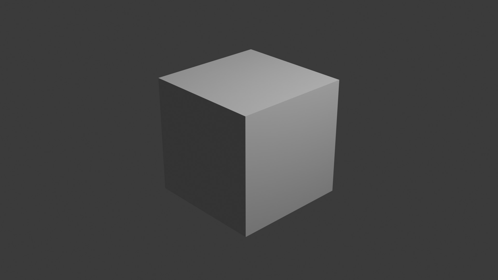
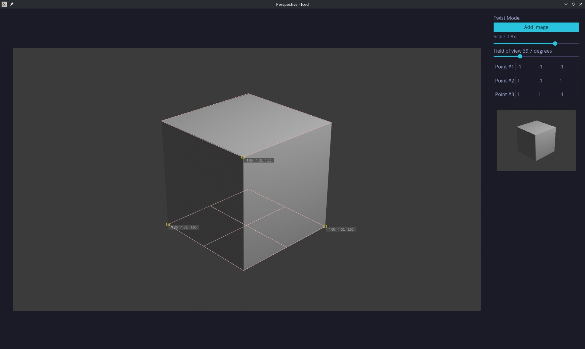
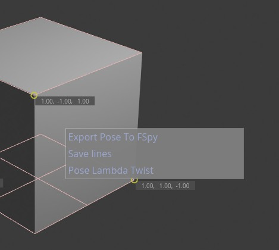
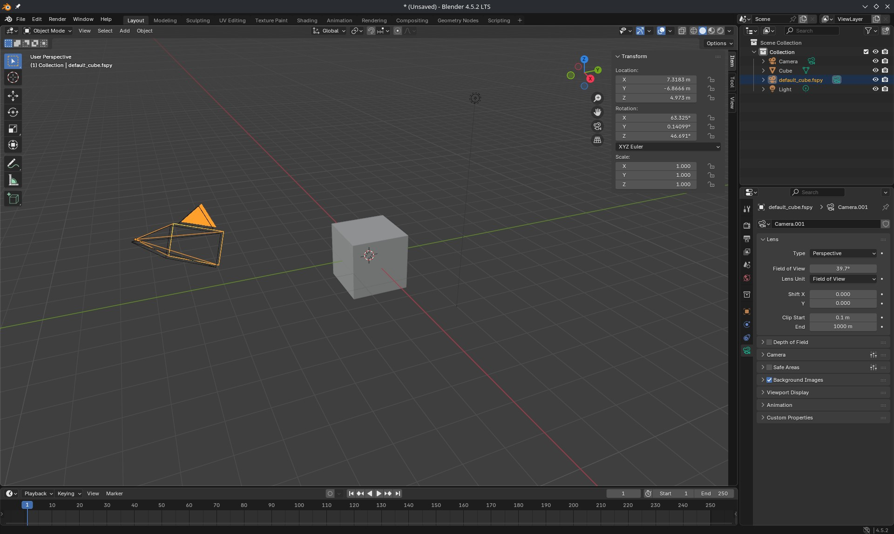

# Notes

## implemetation

starting point for the implementation `https://github.com/stuffmatic/fSpy-Blender`, after switched to pose estimation using lambda twist that requires to have 3 world points


## documentation

- `https://annals-csis.org/proceedings/2012/pliks/110.pdf`
- `https://openaccess.thecvf.com/content_ECCV_2018/papers/Mikael_Persson_Lambda_Twist_An_ECCV_2018_paper.pdf`

## example

Rendered default cube:


Prespective App:


Right Click to export pose in fSpy format:


Import calculated pose back to Blender:


## cargo run from command line

```sh
RUST_LOG=perspective=trace cargo r --release -- -i perspective.jpg
```

## calibration params

```sh
cargo r --release --example calibrate

k3=-.008
field of view = 100.9

```

## build

```sh
cargo build --release
cross build --target x86_64-pc-windows-gnu --release
```
